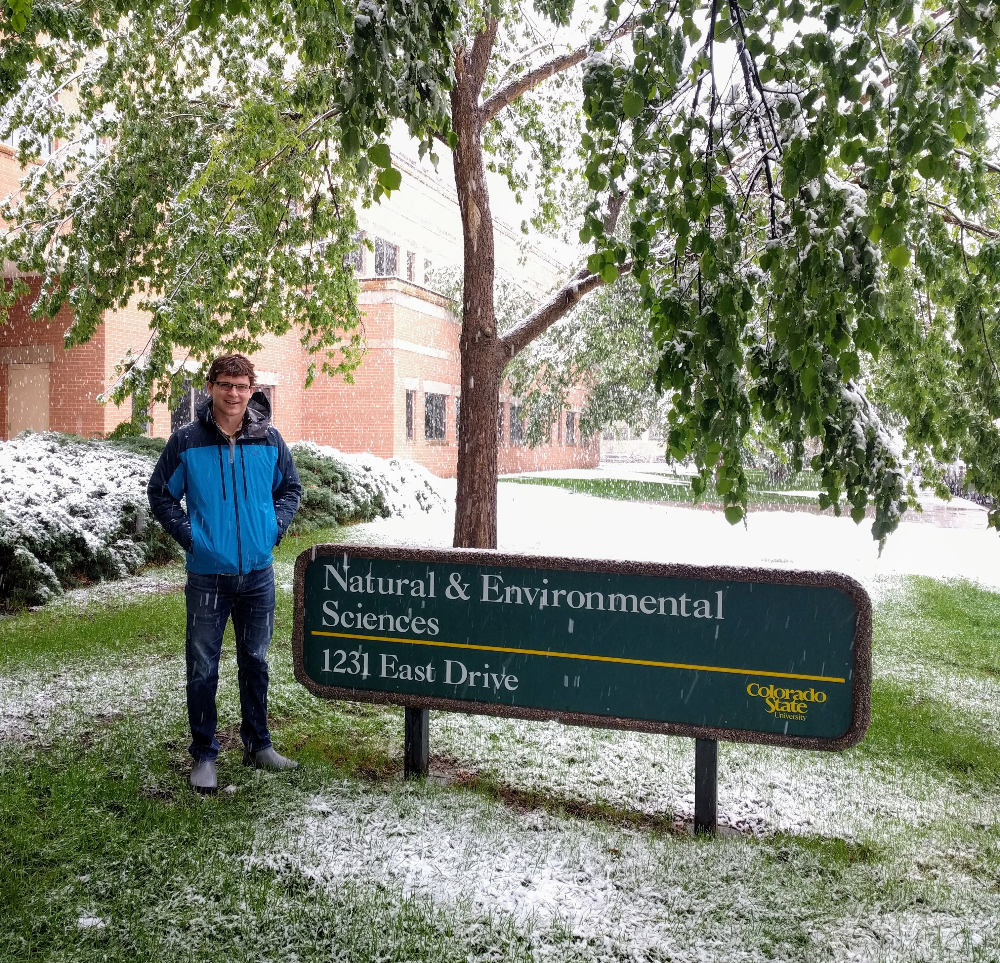

<br>

####I'm an ecosystem scientist currently working at UNC Chapel Hill
####with Tamlin Pavelsky's [Global Hydrology Lab.](http://www.unc.edu/~pavelsky/Pavelsky/Home.html)
####In August 2018, I will start as an assistant professor at
####Colorado State's [Ecosystem Science and Sustainability department](https://warnercnr.colostate.edu/ess/).
####My broadest research goals are best captures by a quote from
####John Tillman Lyle in 1985 when he said: 

<br>

#####  The point is that if we are going to design ecosystems,
#####  and we continually do so whether we care to face
#####  all of the implications or not, then it will be best
#####  to design them intentionally,
#####  making use of all the ecological understanding we can bring to bear.

<br>

#### Towards this goal, I ask these kinds of research questions:


####**1) How do people reshape and change landscapes?**

<br>

####**2) What are the dominant drivers and feedbacks that structure**
####**these landscapes, and how do they influence downstream ecosystems**

<br>

####**3) Can we use knowledge from 1&2 to design ecosystems better?**

<br>
<br>
<br>
<br>


```{r,echo=F,fig.width=3,include=F}

```

